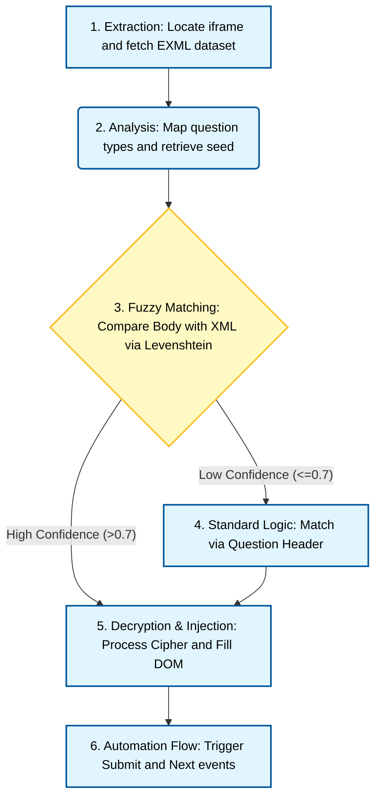

# 📖 Auto EB

**Complete your Wiseman EB tasks in seconds.<br>**
`Auto EB` is a high-efficiency automation engine designed to parse, decrypt, and solve Wiseman LMS tasks automatically using fuzzy string matching and DOM injection.

---

<p align="center" width="100%">
   <video src="https://github.com/user-attachments/assets/2d6ac87f-470f-4371-9583-d1d349d34936" width="80%" controls autoplay loop></video>
</p>

Watch [attachments/demo-video.mp4](attachments/demo-video.mp4).

## 🚀 Getting Started

### Tutorial Video

<p align="center" width="100%">
   <video src="https://github.com/user-attachments/assets/1341b289-c75c-42ca-9d2c-194c42be25a5" width="80%" controls autoplay loop></video>
</p>

Watch [attachments/tutorial.mp4](attachments/tutorial.mp4).

---

### For Safari Users (macOS & iOS)

#### 1. Install a Userscript Manager
Safari requires a third-party app to run userscripts. Download one of the following from the App Store:
* **[Userscripts](https://apps.apple.com/us/app/userscripts/id1463298887)** (Highly recommended, free, and open-source).
* **Tampermonkey for Safari** (Paid).

#### 2. Enable the Extension
* Open **Safari Settings** (or Preferences).
* Go to the **Extensions** tab.
* Find your chosen manager (e.g., "Userscripts") and **check the box** to enable it.
* **Note for iOS:** Go to Settings > Safari > Extensions to enable it there.

#### 3. Install the Script
* **Method A (Automatic):** Click this link: [autoeb.user.js](https://raw.githubusercontent.com/ChuTM/auto-eb/refs/heads/main/dist/autoeb.user.js). Safari should prompt you to "Install" or "Create" the script automatically.
* **Method B (Manual):** Open the [raw script code](https://raw.githubusercontent.com/ChuTM/auto-eb/refs/heads/main/dist/autoeb.user.js) and copy everything. Paste it into your manager's dashboard and save.

---

### Safari 瀏覽器用戶 (macOS & iOS)

#### 1. 安裝用戶腳本管理器 (Userscript Manager)
Safari 需要透過第三方應用程式來執行用戶腳本。請從 App Store 下載以下其中一款：
* **[Userscripts](https://apps.apple.com/tw/app/userscripts/id1463298887)** (強力推薦，免費且開源)。
* **Tampermonkey for Safari** (付費版)。

#### 2. 啟用擴充功能
* 開啟 **Safari 設定** (或偏好設定)。
* 前往 **擴充功能** 分頁。
* 找到您選擇的管理器 (例如 "Userscripts") 並 **勾選方框** 以啟用。
* **iOS 用戶請注意：** 請前往「設定」>「Safari」>「擴充功能」進行啟用。

#### 3. 安裝腳本
* **方法 A (自動安裝)：** 點擊此連結：[autoeb.user.js](https://raw.githubusercontent.com/ChuTM/auto-eb/refs/heads/main/dist/autoeb.user.js)。Safari 應會自動彈出提示詢問是否「安裝」或「建立」腳本。
* **方法 B (手動安裝)：** 開啟 [原始腳本代碼](https://raw.githubusercontent.com/ChuTM/auto-eb/refs/heads/main/dist/autoeb.user.js) 並複製所有內容。將其貼上至管理器的控制面板並儲存。

### For All Other Browsers (Chrome, Edge, Firefox, Brave)

#### 1. Install Tampermonkey
Visit the **[Tampermonkey Official Website](https://www.tampermonkey.net/)** and install the extension.

#### 2. Configure Browser Settings
* **Enable Developer Mode:** Go to your Extensions page and toggle **Developer Mode** to **ON**.
* **Allow User Scripts:** In Tampermonkey details, enable **"Allow access to file URLs"**. (For Chrome/Edge) ensure **"Allow user scripts"** is enabled in the extension settings to prevent blocking.

#### 3. Install the Script
* Open the [autoeb.user.js](https://raw.githubusercontent.com/ChuTM/auto-eb/refs/heads/main/dist/autoeb.user.js) link and click **Install**.

--- 

### 其他瀏覽器用戶 (Chrome, Edge, Firefox, Brave)

#### 1. 安裝 Tampermonkey
請造訪 **[Tampermonkey 官方網站](https://www.tampermonkey.net/)** 並安裝擴充功能。

#### 2. 設定瀏覽器
* **開啟開發者模式：** 前往瀏覽器的「擴充功能」頁面，並將 **「開發者模式」** 切換為 **開啟**。
* **允許用戶腳本：** 在 Tampermonkey 的詳細設定中，勾選 **「允許存取檔案網址」**。 (針對 Chrome/Edge) 請確保在擴充功能設定中啟用了 **「允許用戶腳本」** 以防止被系統封鎖。

#### 3. 安裝腳本
* 開啟 [autoeb.user.js](https://raw.githubusercontent.com/ChuTM/auto-eb/refs/heads/main/dist/autoeb.user.js) 連結，然後點擊 **安裝**。

---

### For Developers (Build from Source)

1. **Install Dependencies**: `npm install`
2. **Build**: `node build.mjs`  
   _This bundles source files into a single IIFE script in the `dist` folder._

---

## 🛠️ How It Works

The engine operates through a coordinated four-stage pipeline:

1.  **Extraction**: Locates the active course `iframe` and fetches the underlying `course_pc.exml` dataset.
2.  **Fuzzy Analysis**: Parses the XML structure. Unlike standard matchers, Auto EB builds a **Body Fingerprint** using text fragments from the `<set>` tags to distinguish between questions with identical headers.
3.  **Similarity Engine**: Uses a Levenshtein-based similarity algorithm in `utils.js` to compare the current UI text with the decrypted XML database. A match is only confirmed if the similarity score is $> 0.7$ (70%).
4.  **Decryption & Injection**: Processes obfuscated strings using a custom Caesar-style shift and programmatically triggers DOM events for seamless automation.

### Pipeline Flowchart



---

## 📊 Feature Roadmap

| Feature | Status | Description |
| :--- | :--- | :--- |
| **Single Fill-in** | ✅ Stable | Single text input detection and entry. |
| **Standard MCQ** | ✅ Stable | Radio button selection and auto-submit. |
| **Fuzzy Matching** | ✅ Stable | Prevents duplicate header collision errors using Levenshtein. |
| **Multi Fill-in/Select** | ✅ Stable | Supports multiple inputs and dropdowns per slide. |
| **Variable Timing** | ✅ Stable | Configurable delays to avoid platform detection. |
| **Punctuation Bypass** | ✅ Stable | Aggressive HTML decoding to ignore symbols and periods. |
| **Settings Menu** | 🏗️ In Progress | UI for adjusting speed, modes, and injection logic. |
| **Human-Like Typing** | ⏳ Planned | Character-by-character input simulation with variable speed. |
| **Auto-Retry Engine** | ⏳ Planned | Logic to detect failed XML fetches and refresh the task. |
| **Competition Analyst** | ⏳ Planned | Integrated market share and economic data for specific modules. |
| **Dashboard** | ⏳ Planned | Live session stats (Total cracked, accuracy, time saved). |
| **On-site Support** | ⏳ Planned | Integrated "Debug Overlay" for manual matching if fuzzy logic fails. |

---

## 📂 Project Structure

```text
├── dist/                # Compiled Userscript
├── src/                 # Modular Source Code
│   ├── config.js        # Global constants & Cipher MAP
│   ├── logic.js         # Fuzzy matching & automation flow
│   ├── main.js          # UI Entry point (The "Activate" button)
│   └── utils.js         # Decryption engine & Similarity logic
├── build.mjs            # ESBuild configuration script
└── package.json         # Build dependencies
```

---

## ⚠️ Disclaimer

**For Educational Purposes Only.** This project is a proof-of-concept demonstrating how client-side obfuscation can be bypassed. The authors are not responsible for any misuse, academic consequences, or account bans. Please use this tool responsibly.
