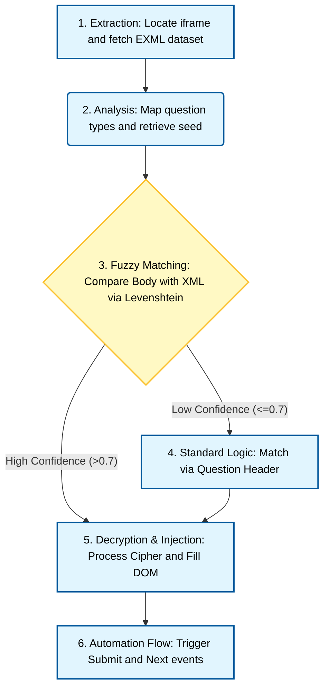

# [📖 AutoEB](https://raw.githubusercontent.com/ChuTM/auto-eb/refs/heads/main/dist/autoeb.user.js)

- **Method A (Automatic):** Click this link: [autoeb.user.js](https://raw.githubusercontent.com/ChuTM/auto-eb/refs/heads/main/dist/autoeb.user.js). Browser should prompt you to "Install" or "Create" the script automatically.

- **方法 A (自動安裝)：** 點擊此連結：[autoeb.user.js](https://raw.githubusercontent.com/ChuTM/auto-eb/refs/heads/main/dist/autoeb.user.js)。瀏覽器應會自動彈出提示詢問是否「安裝」或「建立」腳本。

---

## ⏱️ AutoEB Smart Time Control 智能答題時間系統

AutoEB automatically randomises the duration of each task to prevent detection. To change this, go to `AutoEB Settings` and set the `Step Delay (ms)` to a range between `100` and `200` to achieve the same speed in presentations.

AutoEB 會自動隨機調整每個步驟的執行時間以防止被偵測。如欲更改此設定，請前往 `AutoEB Settings` 並將 `Step Delay (ms)` 調整在 `100` 至 `200` 之間以達至演示效果。

---

## 📺 Watch Tutorial 觀看教學影片

<p align="center" width="100%">
   <video src="https://github.com/user-attachments/assets/5eb654eb-1cfd-4595-8765-d68eb0162180" width="80%" controls autoplay loop></video>
</p>

Watch 觀看 [attachments/tutorial-ios.mp4](attachments/tutorial-ios.mp4).

**Complete your Wiseman EB tasks in seconds.** `AutoEB` is a high-efficiency automation engine designed to parse, decrypt, and solve Wiseman LMS tasks automatically using fuzzy string matching and DOM injection.

**在數秒內完成您的 Wiseman EB 任務。** `AutoEB` 是一款高效自動化引擎，專為自動解析、解密和完成 Wiseman LMS 任務而設計，採用模糊字串比對和 DOM 注入技術。

---

<p align="center" width="100%">
   <video src="https://github.com/user-attachments/assets/2d6ac87f-470f-4371-9583-d1d349d34936" width="80%" controls autoplay loop></video>
</p>

Watch 觀看 [attachments/demo-video.mp4](attachments/demo-video.mp4).

---

## 🚀 Getting Started 開始使用

### Tutorial Video 教學影片

<p align="center" width="100%">
   <video src="https://github.com/user-attachments/assets/1341b289-c75c-42ca-9d2c-194c42be25a5" width="80%" controls autoplay loop></video>
</p>

Watch 觀看 [attachments/tutorial.mp4](attachments/tutorial.mp4).

---

### For Safari Users (macOS & iOS) Safari 瀏覽器用戶 (macOS & iOS)

#### 1. Install a Userscript Manager 安裝用戶腳本管理器 (Userscript Manager)

- Safari requires a third-party app to run userscripts. Download one of the following from the App Store:
- **[Userscripts](https://apps.apple.com/us/app/userscripts/id1463298887)** (Highly recommended, free, and open-source).
- **Tampermonkey for Safari** (Paid).
- Safari 需要透過第三方應用程式來執行用戶腳本。請從 App Store 下載以下其中一款：
- **[Userscripts](https://apps.apple.com/tw/app/userscripts/id1463298887)** (強力推薦，免費且開源)。
- **Tampermonkey for Safari** (付費版)。

#### 2. Enable the Extension 啟用擴充功能

- Open **Safari Settings** (or Preferences).
    - Go to the **Extensions** tab.
    - Find your chosen manager (e.g., "Userscripts") and **check the box** to enable it.
    - **Note for iOS:** Go to Settings > Safari > Extensions to enable it there.
- 開啟 **Safari 設定** (或偏好設定)。
- 前往 **擴充功能** 分頁。
- 找到您選擇的管理器 (例如 "Userscripts") 並 **勾選方框** 以啟用。
- **iOS 用戶請注意：** 請前往「設定」>「Safari」>「擴充功能」進行啟用。

#### 3. Install the Script 安裝腳本

- **Method A (Automatic):** Click this link: [autoeb.user.js](https://raw.githubusercontent.com/ChuTM/auto-eb/refs/heads/main/dist/autoeb.user.js). Safari should prompt you to "Install" or "Create" the script automatically.
    - **Method B (Manual):** Open the [raw script code](https://raw.githubusercontent.com/ChuTM/auto-eb/refs/heads/main/dist/autoeb.user.js) and copy everything. Paste it into your manager's dashboard and save.
- **方法 A (自動安裝)：** 點擊此連結：[autoeb.user.js](https://raw.githubusercontent.com/ChuTM/auto-eb/refs/heads/main/dist/autoeb.user.js)。Safari 應會自動彈出提示詢問是否「安裝」或「建立」腳本。
- **方法 B (手動安裝)：** 開啟 [原始腳本代碼](https://raw.githubusercontent.com/ChuTM/auto-eb/refs/heads/main/dist/autoeb.user.js) 並複製所有內容。將其貼上至管理器的控制面板並儲存。

---

### For All Other Browsers (Chrome, Edge, Firefox, Brave) 其他瀏覽器用戶 (Chrome, Edge, Firefox, Brave)

#### 1. Install Tampermonkey 安裝 Tampermonkey

- Visit the **[Tampermonkey Official Website](https://www.tampermonkey.net/)** and install the extension.
- 請造訪 **[Tampermonkey 官方網站](https://www.tampermonkey.net/)** 並安裝擴充功能。

#### 2. Configure Browser Settings 設定瀏覽器

- **Enable Developer Mode:** Go to your Extensions page and toggle **Developer Mode** to **ON**.
    - **Allow User Scripts:** In Tampermonkey details, enable **"Allow access to file URLs"**. (For Chrome/Edge) ensure **"Allow user scripts"** is enabled in the extension settings to prevent blocking.
- **開啟開發者模式：** 前往瀏覽器的「擴充功能」頁面，並將 **「開發者模式」** 切換為 **開啟**。
- **允許用戶腳本：** 在 Tampermonkey 的詳細設定中，勾選 **「允許存取檔案網址」**。 (針對 Chrome/Edge) 請確保在擴充功能設定中啟用了 **「允許用戶腳本」** 以防止被系統封鎖。

#### 3. Install the Script 安裝腳本

- Open the [autoeb.user.js](https://raw.githubusercontent.com/ChuTM/auto-eb/refs/heads/main/dist/autoeb.user.js) link and click **Install**.
- 開啟 [autoeb.user.js](https://raw.githubusercontent.com/ChuTM/auto-eb/refs/heads/main/dist/autoeb.user.js) 連結，然後點擊 **安裝**。

---

### For Developers (Build from Source) 開發者指南 (從原始碼構建)

-   1. **Install Dependencies**: `npm install`
    2. **Build**: `node build.mjs`  
       _This bundles source files into a single IIFE script in the `dist` folder._
-   1. **安裝依賴項目**: `npm install`
    2. **專案構建**: `node build.mjs`  
       _這會將原始檔案打包成一個單一的 IIFE 腳本，並輸出至 `dist` 資料夾中。_

---

## 🛠️ How It Works 運作原理

- The engine operates through a coordinated four-stage pipeline:

1. **Extraction**: Locates the active course `iframe` and fetches the underlying `course_pc.exml` dataset.
2. **Fuzzy Analysis**: Parses the XML structure. Unlike standard matchers, AutoEB builds a **Body Fingerprint** using text fragments from the `<set>` tags to distinguish between questions with identical headers.
3. **Similarity Engine**: Uses a Levenshtein-based similarity algorithm in `utils.js` to compare the current UI text with the decrypted XML database. A match is only confirmed if the similarity score is $> 0.7$ (70%).
4. **Decryption & Injection**: Processes obfuscated strings using a custom Caesar-style shift and programmatically triggers DOM events for seamless automation.

- 本引擎透過一個協調的四階段流水線運作：

1. **資料提取 (Extraction)**：定位當前活動的課程 `iframe` 並獲取底層的 `course_pc.exml` 數據集。
2. **模糊分析 (Fuzzy Analysis)**：解析 XML 結構。與標準匹配器不同，AutoEB 利用 `<set>` 標籤中的文本片段構建 **主體特徵指紋 (Body Fingerprint)**，以區分標題完全相同的不同問題。
3. **相似度引擎 (Similarity Engine)**：使用 `utils.js` 中基於 Levenshtein 距離的相似度算法，比對當前 UI 文本與解密後的 XML 資料庫。僅在相似度得分 $> 0.7$ (70%) 時才確認匹配。
4. **解密與注入 (Decryption & Injection)**：使用自定義的凱撒式移位演算法處理混淆字串，並透過程式觸發 DOM 事件以實現無縫自動化。

### Pipeline Flowchart 流水線流程圖


```mermaid
graph TD
    A[1. Extraction: Locate iframe and fetch EXML dataset]
    B(2. Analysis: Map question types and retrieve seed)

    A --> B

    C{3. Fuzzy Matching: Compare Body with XML via Levenshtein}

    B --> C

    C -- "High Confidence (>0.7)" --> D
    C -- "Low Confidence (<=0.7)" --> E

    E[4. Standard Logic: Match via Question Header]
    E --> D

    D[5. Decryption & Injection: Process Cipher and Fill DOM]
    F[6. Automation Flow: Trigger Submit and Next events]

    D --> F

    classDef step fill:#e1f5fe,stroke:#01579b,stroke-width:2px,color:#000;
    classDef decision fill:#fff9c4,stroke:#fbc02d,stroke-width:2px,color:#000;

    class A,B,D,E,F step;
    class C decision;

```

---

## 📊 Feature Roadmap 功能路線圖

| Feature / 功能                           | Status / 狀態       | Description / 描述                                                                                                          |
| ---------------------------------------- | ------------------- | --------------------------------------------------------------------------------------------------------------------------- |
| **Single Fill-in** / 單項填空            | ✅ Stable / 穩定    | Single text input detection and entry. / 單一文本輸入檢測與填入。                                                           |
| **Standard MCQ** / 標準選擇題            | ✅ Stable / 穩定    | Radio button selection and auto-submit. / 單選按鈕自動選擇與提交。                                                          |
| **Fuzzy Matching** / 模糊匹配            | ✅ Stable / 穩定    | Prevents duplicate header collision errors using Levenshtein. / 使用 Levenshtein 演算法防止重複標題衝突錯誤。               |
| **Multi Fill-in/Select** / 多項填空/選擇 | ✅ Stable / 穩定    | Supports multiple inputs and dropdowns per slide. / 支援每張投影片中的多個輸入框和下拉選單。                                |
| **Variable Timing** / 可變計時           | ✅ Stable / 穩定    | Configurable delays to avoid platform detection. / 可配置延遲時間以避開平台偵測。                                           |
| **Punctuation Bypass** / 標點符號忽略    | ✅ Stable / 穩定    | Aggressive HTML decoding to ignore symbols and periods. / 強力 HTML 解碼，自動忽略符號與句點。                              |
| **Settings Menu** / 設定選單             | ✅ Stable / 穩定    | UI for adjusting speed, modes, and injection logic. / 用於調整速度、模式和注入邏輯的 UI 介面。                              |
| **Human-Like Typing** / 擬真人類輸入     | ✅ Stable / 穩定    | Character-by-character input simulation with variable speed. / 具備變速功能、逐字模擬人類輸入。                             |
| **Auto-Retry Engine** / 自動重試引擎     | ✅ Stable / 穩定    | Logic to detect failed XML fetches and refresh the task. / 檢測 XML 獲取失敗並自動重新整理任務的邏輯。                      |
| **Competition Analyst** / 競賽分析模組   | ⏳ Planned / 計劃中 | Integrated market share and economic data for specific modules. / 針對特定模組整合市佔率與經濟數據分析。                    |
| **Dashboard** / 數據儀表板               | ⏳ Planned / 計劃中 | Live session stats (Total cracked, accuracy, time saved). / 即時工作階段統計（總破解數、正確率、已省時間）。                |
| **On-site Support** / 現場除錯支援       | ⏳ Planned / 計劃中 | Integrated "Debug Overlay" for manual matching if fuzzy logic fails. / 整合「除錯重疊介面」，在模糊邏輯失效時進行手動比對。 |

---

## 📂 Project Structure 專案結構

```text
├── dist/                # Compiled Userscript / 已編譯的用戶腳本
├── src/                 # Modular Source Code / 模組化原始碼
│   ├── config.js        # Global constants & Cipher MAP / 全域常數與密碼對照表
│   ├── logic.js         # Fuzzy matching & automation flow / 模糊匹配與自動化流程
│   ├── main.js          # UI Entry point (The "Activate" button) / UI 入口點（「啟動」按鈕）
│   └── utils.js         # Decryption engine & Similarity logic / 解密引擎與相似度邏輯
├── build.mjs            # ESBuild configuration script / ESBuild 配置腳本
└── package.json         # Build dependencies / 專案構建依賴項目

```

---

## ⚠️ Disclaimer 免責聲明

- **For Educational Purposes Only.** This project is a proof-of-concept demonstrating how client-side obfuscation can be bypassed. The authors are not responsible for any misuse, academic consequences, or account bans. Please use this tool responsibly.
- **僅供教育用途。** 本專案為概念驗證（PoC），旨在展示如何繞過客戶端混淆機制。作者對任何濫用行為、學術後果或帳號封禁概不負責。請負責任地使用此工具。
